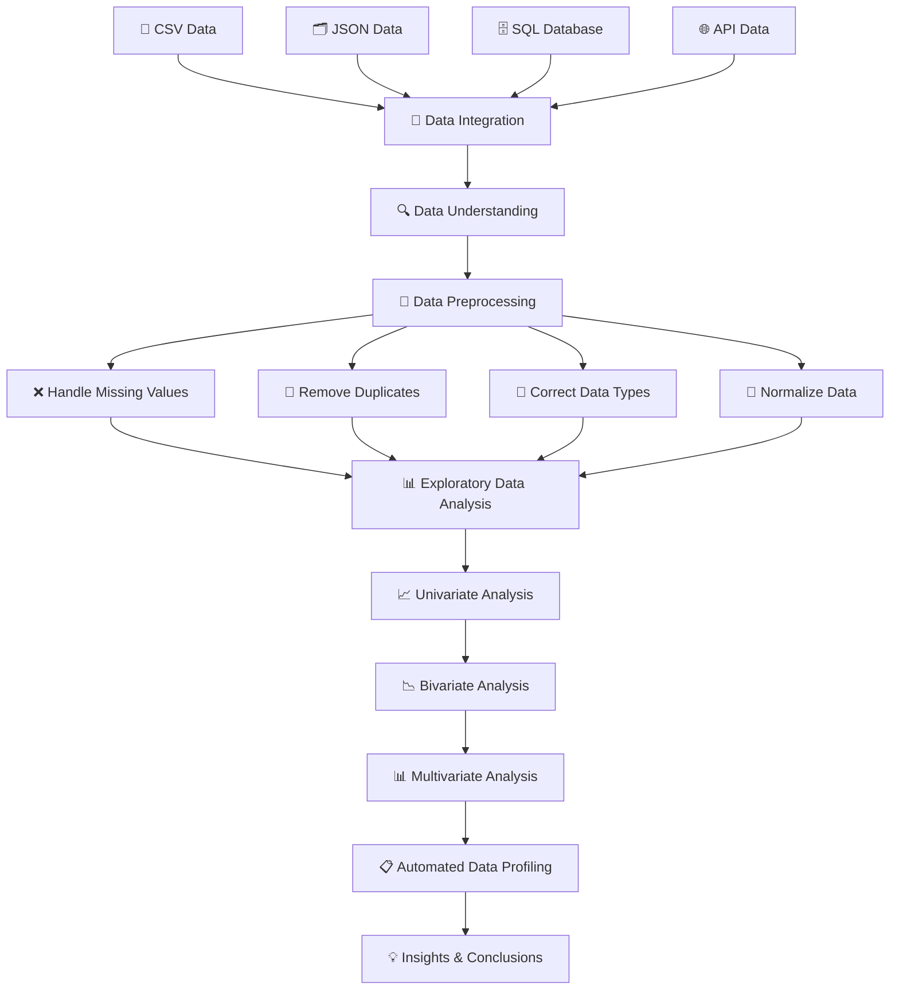

# 📊 Data Profiler

<p align="center">
  
  
  
  
  
  
</p>

<h3 align="center">
  🔍 A Complete End-to-End Data Analysis and Profiling Project
</h3>

<p align="center">
  <b>
    Collect Data → Understand Data → Clean Data → Explore Data → Visualize Data → Profile Data → Generate Insights
  </b>
</p>

<p align="center">
  <a href="YOUR_DEMO_VIDEO_LINK">
    
  </a>
</p>

---


# 📊 About the Project

**Data Profiler** is a complete practical project that demonstrates the end-to-end process of working with data.

The project starts with collecting data from different sources and continues through data exploration, preprocessing, cleaning, analysis, visualization, and automated profiling.

```text
                    ┌─────────────────┐
                    │   📥 RAW DATA    │
                    └────────┬────────┘
                             │
                             ▼
                    ┌─────────────────┐
                    │ 🔍 UNDERSTAND   │
                    │     THE DATA    │
                    └────────┬────────┘
                             │
                             ▼
                    ┌─────────────────┐
                    │  🧹 CLEAN DATA  │
                    └────────┬────────┘
                             │
                             ▼
                    ┌─────────────────┐
                    │   📊 PERFORM    │
                    │      EDA        │
                    └────────┬────────┘
                             │
                             ▼
                    ┌─────────────────┐
                    │ 📈 VISUALIZE    │
                    │    PATTERNS     │
                    └────────┬────────┘
                             │
                             ▼
                    ┌─────────────────┐
                    │ 📋 DATA PROFILING│
                    └────────┬────────┘
                             │
                             ▼
                    ┌─────────────────┐
                    │ 💡 INSIGHTS     │
                    └─────────────────┘
```

---


## 🎯 Project Objective

The main objective of this project is to understand and implement the complete data analysis workflow. 
It focuses on collecting data from different sources such as CSV, JSON, SQL databases, and APIs. 
The project includes data understanding, cleaning, preprocessing, and exploratory data analysis (EDA). 
Univariate, Bivariate, and Multivariate Analysis are performed to identify patterns and relationships in the data. 
The project also uses data visualization and automated data profiling to generate meaningful insights from the dataset.

---

# 🔄 Complete Project Workflow



---

# 📚 Concepts Covered

---

# 1️⃣ Data Analysis

## 📖 Definition

Data Analysis is the process of examining, cleaning, transforming, and studying data to find useful information, patterns, and conclusions.

### Simple Process

```text
Raw Data
   ↓
Clean Data
   ↓
Analyze Data
   ↓
Find Patterns
   ↓
Generate Insights
```

### Example

A business can analyze customer data to understand:

* Who are the most valuable customers?
* Which products are purchased most?
* What patterns exist in the data?

---

# 2️⃣ Tensors

A **Tensor** is a multi-dimensional structure used to store numerical data.

| Tensor Type | Dimension | Example            |
| ----------- | --------: | ------------------ |
| Scalar      |        0D | `5`                |
| Vector      |        1D | `[10, 20, 30]`     |
| Matrix      |        2D | `[[1, 2], [3, 4]]` |
| 3D Tensor   |        3D | Multiple matrices  |

### Tensor Example

```python
import numpy as np

tensor = np.array([
    [[1, 2], [3, 4]],
    [[5, 6], [7, 8]]
])

print("Tensor:")
print(tensor)

print("Dimensions:", tensor.ndim)
print("Shape:", tensor.shape)
```

### Real-Life Example

A color image is a tensor:

```text
Height × Width × Color Channels
```

Example:

```text
224 × 224 × 3
```

Where:

* `224` = Height
* `224` = Width
* `3` = RGB color channels

---

# 3️⃣ Data Acquisition

**Data Acquisition** means collecting data from different sources.

This project demonstrates working with:

```text
📄 CSV
   +
🗂️ JSON
   +
🗄️ SQL Database
   +
🌐 API
```

---

# 4️⃣ Data Integration

Data Integration means combining data from multiple sources into a single dataset.

For example:

```text
Customer Data
      +
Purchase Data
      +
API Data
      ↓
Combined Dataset
```

### Example

```python
combined_data = customer_data.merge(
    purchase_data,
    on="Customer_ID",
    how="left"
)
```

This makes it easier to analyze all related information together.

---

# 5️⃣ Data Understanding

Before cleaning or analyzing data, it is important to understand its structure.

### Important Operations

```python
# First 5 rows
df.head()

# Last 5 rows
df.tail()

# Dataset information
df.info()

# Statistical summary
df.describe()

# Number of rows and columns
df.shape

# Column names
df.columns

# Missing values
df.isnull().sum()

# Duplicate records
df.duplicated().sum()
```

### Data Understanding Helps Us Find:

* Number of rows
* Number of columns
* Data types
* Missing values
* Duplicate values
* Minimum values
* Maximum values
* Average values
* Data distribution

---

# 6️⃣ Data Cleaning

Data Cleaning is the process of fixing incorrect, incomplete, or duplicate data.

The project covers:

```text
Missing Values
      ↓
Duplicate Values
      ↓
Incorrect Data Types
      ↓
Inconsistent Data
      ↓
Clean Dataset
```

---

## ❌ Handling Missing Values

Missing values can be detected using:

```python
df.isnull().sum()
```

### Fill with Mean

```python
df["Age"] = df["Age"].fillna(
    df["Age"].mean()
)
```

### Fill with Median

```python
df["Income"] = df["Income"].fillna(
    df["Income"].median()
)
```

### Fill with Mode

```python
df["Gender"] = df["Gender"].fillna(
    df["Gender"].mode()[0]
)
```

---

## 🔁 Removing Duplicates

```python
print("Duplicates:", df.duplicated().sum())

df = df.drop_duplicates()
```

---

## 🔢 Correcting Data Types

Sometimes numbers are stored as text.

```python
df["Age"] = pd.to_numeric(
    df["Age"],
    errors="coerce"
)
```

---

## 📏 Data Normalization

Normalization changes numerical values to a common scale.

### Min-Max Scaling

```text
New Value =
(Value - Minimum) /
(Maximum - Minimum)
```

### Example

```python
from sklearn.preprocessing import MinMaxScaler

scaler = MinMaxScaler()

df["Income_Normalized"] = scaler.fit_transform(
    df[["Income"]]
)
```

After normalization, values generally fall between:

```text
0 and 1
```

---

# 7️⃣ Exploratory Data Analysis (EDA)

**Exploratory Data Analysis** is the process of exploring and understanding data before making decisions or building machine learning models.

EDA helps answer:

* What data do we have?
* Are values missing?
* Are there duplicates?
* What are the distributions?
* Are there outliers?
* Are variables related?
* Are there any patterns?

---

# 8️⃣ Univariate Analysis

> **Uni = One**

Univariate Analysis means analyzing one variable at a time.

### Example

Analyzing only:

```text
Age
```

or:

```text
Income
```

### Example

```python
import matplotlib.pyplot as plt
import seaborn as sns

sns.histplot(
    df["Age"],
    kde=True
)

plt.title("Age Distribution")
plt.xlabel("Age")
plt.ylabel("Frequency")

plt.show()
```

### Common Charts

* 📊 Histogram
* 📦 Box Plot
* 📈 Bar Chart
* 🥧 Pie Chart

### Questions Answered

* What is the average?
* What is the minimum?
* What is the maximum?
* How is the data distributed?
* Are there outliers?

---

# 9️⃣ Bivariate Analysis

> **Bi = Two**

Bivariate Analysis studies the relationship between two variables.

### Example

```text
Age  ↔  Income
```

or:

```text
Income  ↔  Purchases
```

### Scatter Plot

```python
sns.scatterplot(
    data=df,
    x="Age",
    y="Income"
)

plt.title("Age vs Income")

plt.show()
```

### Box Plot

```python
sns.boxplot(
    data=df,
    x="Gender",
    y="Income"
)

plt.title("Gender vs Income")

plt.show()
```

### Questions Answered

* Is there a relationship between two variables?
* Does one variable change with another?
* Are two groups different?

---

# 🔟 Multivariate Analysis

> **Multi = Many**

Multivariate Analysis studies three or more variables together.

---

## 🔥 Correlation Analysis

Correlation shows how variables are related.

```python
correlation = df.corr(
    numeric_only=True
)

sns.heatmap(
    correlation,
    annot=True
)

plt.title("Correlation Heatmap")

plt.show()
```

### Correlation Values

```text
+1  → Strong Positive Relationship
 0  → No Relationship
-1  → Strong Negative Relationship
```

---

## 🔗 Pair Plot

A pair plot shows relationships between multiple numerical variables.

```python
sns.pairplot(
    df
)

plt.show()
```

It helps analyze:

```text
Variable A ↔ Variable B
Variable A ↔ Variable C
Variable B ↔ Variable C
```

---

# 1️⃣1️⃣ Automated Data Profiling

Automated Data Profiling creates a complete report about a dataset.

The profiling report can include:

| Category         | Information            |
| ---------------- | ---------------------- |
| 📊 Overview      | Rows and columns       |
| 🔢 Variables     | Data types             |
| ❌ Missing Values | Missing data           |
| 🔁 Duplicates    | Duplicate records      |
| 📈 Statistics    | Mean, min, max         |
| 🔗 Correlations  | Variable relationships |
| 📊 Distributions | Data patterns          |

### Example

```python
from ydata_profiling import ProfileReport

profile = ProfileReport(
    df,
    title="Data Profiling Report"
)

profile.to_file(
    "data_profiling_report.html"
)
```

This saves time because many analysis steps are automatically generated.

---

# 📥 Data Sources

The project demonstrates working with different data sources:

| Source   | Format        | Purpose                 |
| -------- | ------------- | ----------------------- |
| 📄 CSV   | `.csv`        | Structured tabular data |
| 🗂️ JSON | `.json`       | Semi-structured data    |
| 🗄️ SQL  | Database      | Relational data         |
| 🌐 API   | JSON Response | External data           |

---

# 📊 Visualization Techniques

The project uses different visualizations for different analysis requirements.

| Visualization   | Used For                       |
| --------------- | ------------------------------ |
| 📊 Histogram    | Distribution                   |
| 📦 Box Plot     | Outliers and groups            |
| 📈 Bar Chart    | Category comparison            |
| 🔵 Scatter Plot | Relationship between variables |
| 🔥 Heatmap      | Correlation analysis           |
| 🔗 Pair Plot    | Multiple relationships         |
| 🥧 Pie Chart    | Category proportions           |

---

# 🛠️ Technologies Used

| Technology          | Purpose                         |
| ------------------- | ------------------------------- |
| 🐍 Python           | Programming                     |
| 🐼 Pandas           | Data Analysis                   |
| 🔢 NumPy            | Numerical Computing and Tensors |
| 📊 Matplotlib       | Visualization                   |
| 🎨 Seaborn          | Statistical Visualization       |
| 🗄️ MySQL           | Database                        |
| 📋 YData Profiling  | Automated Data Profiling        |
| 📓 Jupyter Notebook | Development                     |

---


# 👨‍💻 Author

## Jeel Prajapati

<p align="left">
  <a href="https://github.com/jeelprajapati0606">
    
  </a>
</p>

---

## ⭐ Support the Project

If you found this project useful, please consider giving it a ⭐ on GitHub.

---

<p align="center">
  <b>Built with 🐍 Python • 📊 Data Analysis • 🔍 EDA • 💡 Curiosity</b>
</p>
